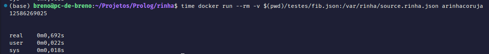

# Rinha de Compiladores (Em Prolog 🦉)

_Todo homem é mortal_ \
_Sócrates é homem_ \
_Logo, Sócrates é mortal_

```prolog
homem(socrates).
homem(breno).
homem(gustavo).
homem(osmar).
% ...

mortal(Homem) :- homem(homem).

% ?- mortal(socrates).
```

## Como rodar local

Testado no Ubuntu 22.04, com SWI-Prolog "SWI-Prolog version 9.0.4 for x86_64-linux"

```bash
make && ./out/main testes/fib.json
```

## Rodando no docker

Gere a imagem

```bash
docker build -t acorujadarinha .
```

Execute o teste:

```bash
docker run --rm -v $(pwd)/testes/fib.json:/var/rinha/source.rinha.json acorujadarinha
```

## Exemplo

### fib.json, n  = 50

